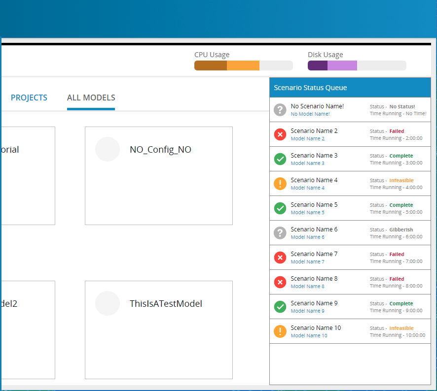

# scenario-status-queue

Self-contained widget for displaying scenario status queues. The goal is to provide the control as part of a Solving widgets npm package which modeling will consume. (XCOM-71)

Requirements will be further fleshed out at a later time, but for now (Oct 2017):
* The package displays 10 scenario status queues. In the future this will be 'most recent'.
* The package currently uses mocked data for representation. In future it should be hooked up with the right backend endpoints and api urls.
* This package is bundled with the necessary react components, css styles, actions and redux reducer etc that are necessary to run the widget.





## Install

The easiest way to use this package is to install it from NPM and include it in your own React build process (using Browserify, Webpack, etc).

```js
  npm install --save git+https://mtctfs/tfs/Dev/Sites/_git/scenario-status-queue
```

You can also use the standalone build by including ```scenarioStatusQueue.min.js``` in your page. If you use this, make sure you have already included React, and it is available as a global variable.

## Usage
#### Step 1
Import the component from the package and pass a list of predefined props to it.

```js
  import { ScenarioStatusQueue } from 'scenario-status-queue';

  <ScenarioStatusQueue
    headerText={'Scenario Status Queue'}
  />
```
If you want to configure it to your application needs, you can pass props to the package, and make the neccessary changes in the package's repo and code base to consume the new props. The ```"headerText"``` is an example of how you can do it. It is an optional props.

#### Step 2
Import the package's reducer and combine it with that of your application.

```js
  import { scenarioStatusQueueReducer } from 'scenario-status-queue';

  const reducers = combineReducers({
    otherReducers,
    scenarioStatusQueueReducer,
    .
    .
    etc
  });

```
This way the application can access the package's redux store data.

# Package Setup
##### Components
Dependencies are exported from ```../src/index.js```:
```js
  // components
  export { default as ScenarioStatusQueue } from './components';

  // reducers
   export { default as scenarioStatusQueueReducer } from './reducers';

```

Inside the package's component (```src/components/index.js```) we define the `mapStateToProps` function as follows to map the package's internal redux store to props:

```js
  import { fetchScenarioStatusQueue } from '../actions';
  .
  .
  const mapStateToProps = (state) => ({
    queue: state.scenarioStatusQueueReducer && state.scenarioStatusQueueReducer.queue
  });

  const mapDispatchToProps = dispatch => bindActionCreators({fetchScenarioStatusQueue}, dispatch);
```

Then we can for example use ```"this.props.queue"``` to access the props value ```"queue"```, in this case an array.

##### SCSS and Styles

You can create an scss file for each component in the package, then import the scss file into the main global scss file (ScenarioStatusQueue.scss).
The package is configured in a way that it will be compatible with projects whether they use css-modules or not.

Example:

```js
  :global{
    @import './colors.scss';
    @import '../components/ScenarioStatus.scss';

    // comes at the end to get higher specificity when css-modules are not used
    @import '../components/index.scss';
  }
```

The above file should be imported in each individual component:

```js
  import styles from '../styles/ScenarioStatusQueue.scss';
  .
  .
  <div
    className={[
      styles.someClassOne || 'someClassOne',
      styles.someClassTwo || 'someClassTwo',
      //...etc
    ].join(' ')}
  />
```

NOTE 1: If css-modules is enabled then ```"styles.someClassOne"``` will be used, otherwise ```"someClassOne"``` will be used. Therefore make sure you follow this format when you are adding classNames to a component.

NOTE 2: The use of css-modules are highly recommended.

##### Actions and Reducers

You can add and create actions, action creators and redux reducers as you would normally do in any reactJs application.

##### Building and Testing

```js
  npm run-script build
  npm run-script test
```
